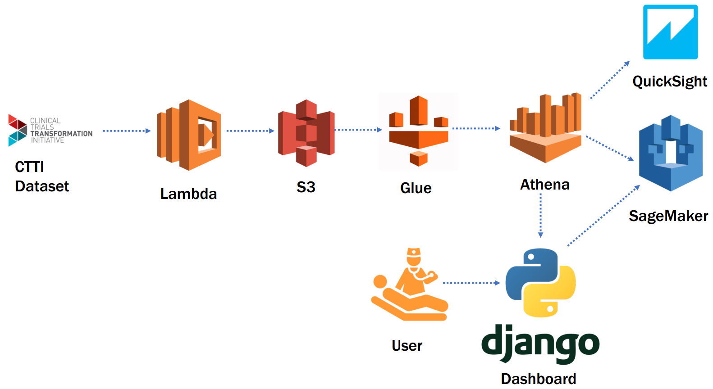

# TiberSolutions
Heinz College Capstone Project

## Project Objective
Explore the new Data Lake architecture for modern business analytics to show that it can provide information to the business easily.  
The project will also utilize the Data Lake to answer a specific question as defined by the business.

## Technology Components

